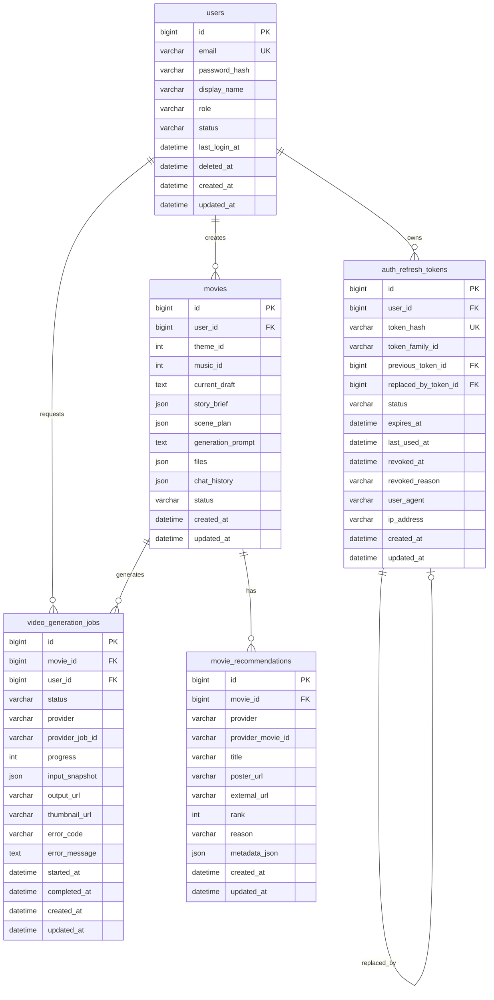
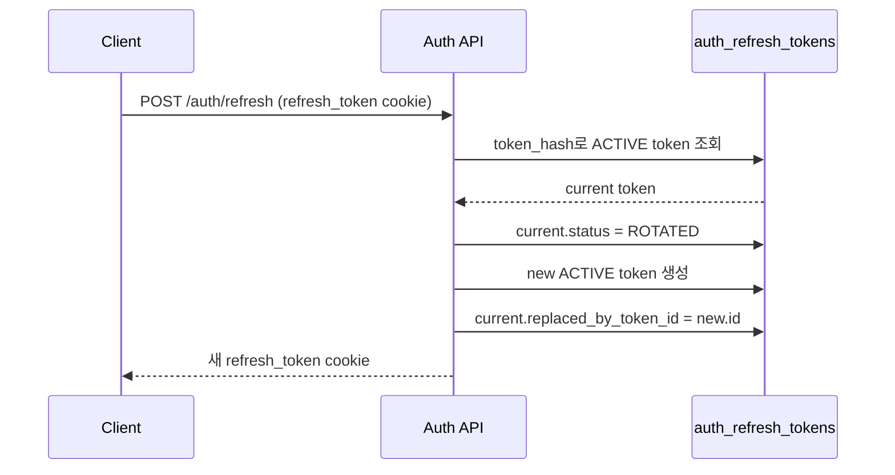
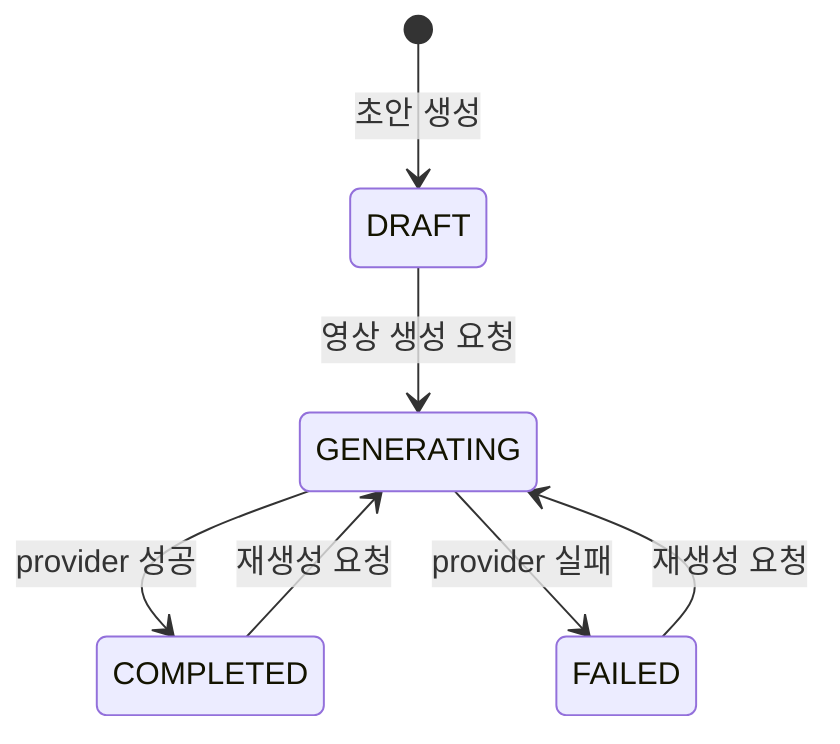
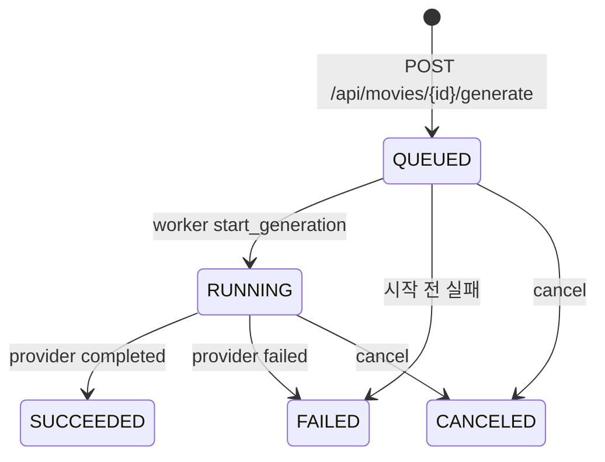
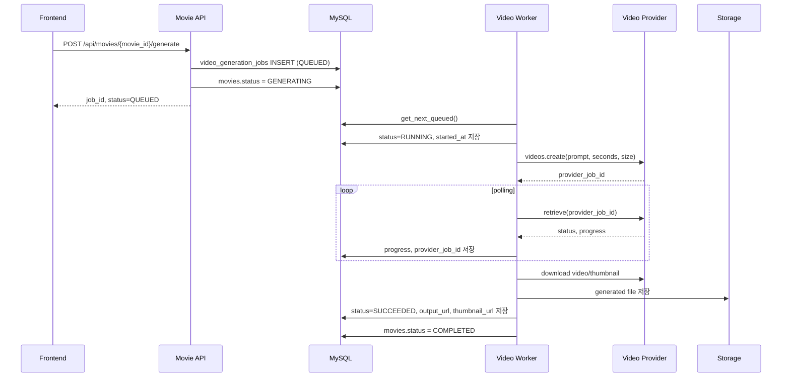
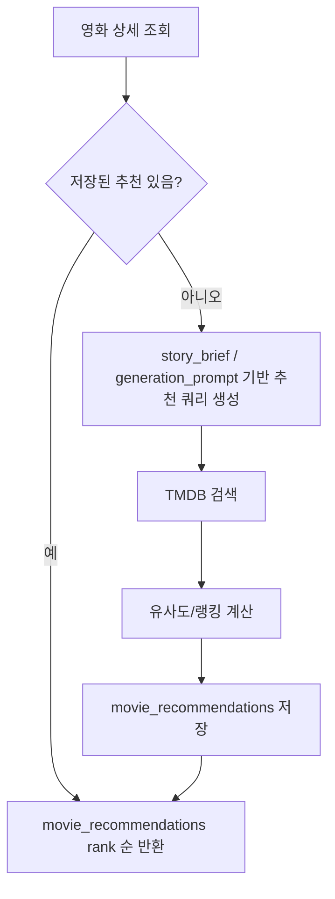
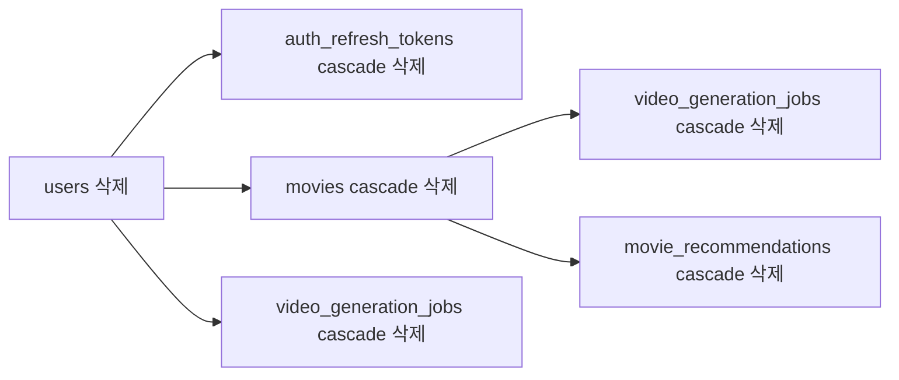

# My Life Movie ERD

이 문서는 현재 `develop` 기반 백엔드 데이터 모델을 팀원이 빠르게 이해하고 이어서 개발할 수 있도록 정리한 ERD 문서입니다.

기준 코드:
- SQLAlchemy 모델: `app/models`
- Alembic migration: `migrations/versions`
- 현재 핵심 도메인: 인증, 영화 제작, 영상 생성 Job, 유사 영화 추천

## 1. 전체 구조



## 2. 도메인별 책임

| 도메인 | 테이블 | 책임 |
| --- | --- | --- |
| 인증 | `users` | 사용자 계정, 권한, 상태, 마지막 로그인 시각 |
| 인증 | `auth_refresh_tokens` | refresh token 저장, 회전, 폐기, 재사용 탐지 |
| 영화 제작 | `movies` | 사용자가 만드는 영화의 현재 입력 상태와 생성 준비 데이터 |
| 영상 생성 | `video_generation_jobs` | 비동기 영상 생성 요청, provider 상태, 결과물 URL, 실패 원인 |
| 추천 | `movie_recommendations` | TMDB 등 외부 provider 기반 유사 영화 추천 결과 저장 |
| 레거시/참조 | `famous_movies` | 초기 장르별 유명 영화 seed. 현재 핵심 추천 흐름은 `movie_recommendations` 사용 |

## 3. 사용자와 인증 토큰

### 3.1 `users`

사용자의 계정 원장입니다. 인증과 영화 소유권의 기준이 됩니다.

| 컬럼 | 타입 | 필수 | 설명 |
| --- | --- | --- | --- |
| `id` | bigint | O | PK |
| `email` | varchar(320) | O | 로그인 이메일. `uq_users_email`로 유일 |
| `password_hash` | varchar(255) | O | Argon2 등 단방향 해시 저장 |
| `display_name` | varchar(80) | X | 표시 이름 |
| `role` | varchar(32) | O | `USER`, `ADMIN` |
| `status` | varchar(32) | O | `PENDING`, `ACTIVE`, `DISABLED`, `DELETED` |
| `last_login_at` | datetime | X | 마지막 로그인 성공 시각 |
| `deleted_at` | datetime | X | 소프트 삭제 시각 |
| `created_at` | datetime | O | 생성 시각 |
| `updated_at` | datetime | O | 수정 시각 |

인덱스:
- `uq_users_email`: 이메일 중복 가입 방지
- `ix_users_status`: 상태별 계정 조회
- `ix_users_created_at`: 가입 시각 기준 조회

### 3.2 `auth_refresh_tokens`

refresh token 원문은 저장하지 않고 `sha256` hash만 저장합니다. 토큰 회전 방식으로 운영합니다.

| 컬럼 | 타입 | 필수 | 설명 |
| --- | --- | --- | --- |
| `id` | bigint | O | PK |
| `user_id` | bigint | O | `users.id` FK. 사용자 삭제 시 cascade |
| `token_hash` | varchar(64) | O | refresh token sha256 hash. 유일 |
| `token_family_id` | varchar(64) | O | 같은 로그인 세션에서 이어지는 token family |
| `previous_token_id` | bigint | X | 이전 refresh token |
| `replaced_by_token_id` | bigint | X | 회전 후 새 refresh token |
| `status` | varchar(32) | O | `ACTIVE`, `ROTATED`, `REVOKED`, `EXPIRED` |
| `expires_at` | datetime | O | refresh token 만료 시각 |
| `last_used_at` | datetime | X | 마지막 사용 시각 |
| `revoked_at` | datetime | X | 폐기 시각 |
| `revoked_reason` | varchar(120) | X | 폐기 이유 |
| `user_agent` | varchar(255) | X | 요청 UA |
| `ip_address` | varchar(45) | X | IPv4/IPv6 주소 |
| `created_at` | datetime | O | 생성 시각 |
| `updated_at` | datetime | O | 수정 시각 |

인덱스:
- `uq_auth_refresh_tokens_token_hash`: token hash 중복 방지
- `ix_auth_refresh_tokens_user_status`: 사용자별 활성/폐기 토큰 조회
- `ix_auth_refresh_tokens_family`: token family 추적
- `ix_auth_refresh_tokens_expires_at`: 만료 토큰 정리 대상 조회

토큰 회전 흐름:



재사용 탐지:
- 이미 `ROTATED`, `REVOKED`, `EXPIRED` 상태인 token이 다시 들어오면 재사용으로 간주합니다.
- 응답은 `401 REFRESH_TOKEN_REUSED` 계열 Problem Details로 처리합니다.

## 4. 영화 제작 데이터

### 4.1 `movies`

영화 제작 플로우의 중심 테이블입니다. 사용자가 선택한 테마/음악, AI 대화 결과, 파일 메타데이터, 영상 생성 입력을 함께 보관합니다.

| 컬럼 | 타입 | 필수 | 설명 |
| --- | --- | --- | --- |
| `id` | bigint | O | PK |
| `user_id` | bigint | O | `users.id` FK. 사용자 삭제 시 cascade |
| `theme_id` | int | O | 프론트/백엔드 상수 기반 테마 ID |
| `music_id` | int | X | 선택한 음악 ID |
| `current_draft` | text | X | 현재 AI 대화 기반 이야기 초안 |
| `story_brief` | json | X | 영상 생성용 구조화 스토리 요약 |
| `scene_plan` | json | X | 영상 생성용 장면 계획 |
| `generation_prompt` | text | X | provider에 넘길 최종 영상 생성 프롬프트 |
| `files` | json | X | 업로드 파일 메타데이터와 추출 텍스트 |
| `chat_history` | json | X | 사용자와 AI의 대화 이력 |
| `status` | varchar(32) | O | `DRAFT`, `GENERATING`, `COMPLETED`, `FAILED` |
| `created_at` | datetime | O | 생성 시각 |
| `updated_at` | datetime | O | 수정 시각 |

인덱스:
- `ix_movies_user_status`: 내 영화 목록, 상태별 조회
- `ix_movies_created_at`: 최신 영화 정렬

주요 JSON 구조 예시:

```json
{
  "story_brief": {
    "title": "처음 혼자 선 날",
    "logline": "낯선 도시에서 스스로를 발견하는 성장 이야기",
    "summary": "처음 독립한 사용자가 두려움과 설렘을 지나 자신감을 얻는다.",
    "protagonist": "20대 성인 주인공",
    "emotions": ["설렘", "불안", "성장"],
    "locations": ["작은 방", "밤거리"],
    "ending_tone": "따뜻한 성취감"
  },
  "scene_plan": [
    {
      "order": 1,
      "summary": "주인공이 작은 방에서 짐을 풀고 창밖을 바라본다.",
      "emotion": "설렘",
      "camera": "slow dolly-in"
    }
  ]
}
```

영화 상태 흐름:



## 5. 영상 생성 Job

### 5.1 `video_generation_jobs`

비동기 영상 생성 상태와 provider 결과를 저장합니다. `movies.status`는 사용자 화면용 대표 상태이고, 실제 생성 상세는 이 테이블이 원장입니다.

| 컬럼 | 타입 | 필수 | 설명 |
| --- | --- | --- | --- |
| `id` | bigint | O | PK |
| `movie_id` | bigint | O | `movies.id` FK. 영화 삭제 시 cascade |
| `user_id` | bigint | O | `users.id` FK. 사용자 삭제 시 cascade |
| `status` | varchar(32) | O | `QUEUED`, `RUNNING`, `SUCCEEDED`, `FAILED`, `CANCELED` |
| `provider` | varchar(64) | O | `mock`, `openai`, `fal` 등 |
| `provider_job_id` | varchar(255) | X | 외부 provider의 job/video id |
| `progress` | int | O | 0~100 진행률 |
| `input_snapshot` | json | O | 생성 요청 시점의 입력 패키지 |
| `output_url` | varchar(1024) | X | 최종 영상 URL |
| `thumbnail_url` | varchar(1024) | X | 최종 썸네일 URL |
| `error_code` | varchar(128) | X | 실패 분류 코드 |
| `error_message` | text | X | 실패 상세 메시지 |
| `started_at` | datetime | X | worker 처리 시작 시각 |
| `completed_at` | datetime | X | 성공/실패/취소 완료 시각 |
| `created_at` | datetime | O | 생성 시각 |
| `updated_at` | datetime | O | 수정 시각 |

인덱스:
- `ix_video_generation_jobs_movie_status`: 특정 영화의 진행 중/완료 Job 조회
- `ix_video_generation_jobs_user_created_at`: 사용자별 생성 이력 조회
- `ix_video_generation_jobs_provider_job`: provider job id 역추적

Job 상태 흐름:



실패 코드:

| error_code | 의미 | 대표 대응 |
| --- | --- | --- |
| `PROVIDER_ERROR` | provider 일반 실패 | 로그와 provider 상태 확인 |
| `PROVIDER_TIMEOUT` | provider polling 또는 생성 대기 시간 초과 | 재시도 또는 timeout 조정 |
| `PROVIDER_MODERATION_BLOCKED` | provider 안전성 검토 차단 | 프롬프트 완화, 민감 표현 제거 |

영상 생성 시퀀스:



## 6. 유사 영화 추천

### 6.1 `movie_recommendations`

영화 상세 화면의 유사 영화 추천 결과를 저장합니다. 현재 TMDB 기반 추천 결과를 저장해 재조회 시 같은 결과를 재사용하는 구조입니다.

| 컬럼 | 타입 | 필수 | 설명 |
| --- | --- | --- | --- |
| `id` | bigint | O | PK |
| `movie_id` | bigint | O | `movies.id` FK. 영화 삭제 시 cascade |
| `provider` | varchar(64) | O | `tmdb`, `fallback` 등 |
| `provider_movie_id` | varchar(128) | X | provider의 영화 ID |
| `title` | varchar(255) | O | 추천 영화 제목 |
| `poster_url` | varchar(1024) | O | 포스터 URL |
| `external_url` | varchar(1024) | X | 상세 페이지 URL |
| `rank` | int | O | 노출 순서 |
| `reason` | varchar(255) | X | 추천 이유 |
| `metadata_json` | json | X | score, genre, overview 등 provider 원본 보조 정보 |
| `created_at` | datetime | O | 생성 시각 |
| `updated_at` | datetime | O | 수정 시각 |

인덱스:
- `ix_movie_recommendations_movie_rank`: 영화 상세 추천 목록 정렬
- `ix_movie_recommendations_provider_movie`: provider movie 중복/역추적

추천 흐름:



## 7. 레거시/참조 테이블

### 7.1 `famous_movies`

초기 개발 단계에서 장르별 유명 영화 seed로 만든 테이블입니다. 현재 SQLAlchemy 모델은 없고, 핵심 추천 흐름은 `movie_recommendations`가 담당합니다.

| 컬럼 | 타입 | 필수 | 설명 |
| --- | --- | --- | --- |
| `id` | int | O | PK |
| `title` | varchar(255) | O | 영화 제목 |
| `genre` | varchar(64) | O | 장르/테마 |
| `thumbnail` | varchar(512) | O | 썸네일 URL |

인덱스:
- `ix_famous_movies_genre`

정리 의견:
- 실제 추천을 TMDB 저장형 추천으로 유지한다면 후속 migration에서 제거 후보입니다.
- 발표/데모용 seed로 유지할 계획이면 SQLAlchemy 모델과 사용 지점을 명확히 추가하는 편이 낫습니다.

## 8. 삭제 정책과 참조 무결성



정책:
- 사용자 삭제 시 인증 토큰, 영화, 생성 Job은 함께 삭제됩니다.
- 영화 삭제 시 해당 영화의 생성 Job과 추천 결과도 함께 삭제됩니다.
- refresh token의 이전/대체 token 참조는 `SET NULL`입니다. token row 자체가 지워져도 family 전체가 깨지지 않도록 하기 위함입니다.

주의:
- DB row 삭제와 storage 파일 삭제는 별도 책임입니다.
- 현재 로컬 생성물은 `/generated/...` 경로에 저장됩니다.
- S3 전환 시 DB에는 S3 public URL 또는 presigned download endpoint에서 해석 가능한 key/URL을 저장해야 합니다.

## 9. 주요 조회 패턴

### 내 영화 목록

```sql
SELECT *
FROM movies
WHERE user_id = :user_id
ORDER BY created_at DESC;
```

함께 보는 데이터:
- `video_generation_jobs` 최신 row
- `output_url`, `thumbnail_url`, `status`, `progress`

관련 인덱스:
- `ix_movies_user_status`
- `ix_video_generation_jobs_movie_status`

### 생성 Job polling

```sql
SELECT *
FROM video_generation_jobs
WHERE movie_id = :movie_id
ORDER BY created_at DESC, id DESC
LIMIT 1;
```

프론트는 `GET /api/movies/{movie_id}/generation`으로 이 정보를 조회합니다.

### 유사 영화 추천

```sql
SELECT *
FROM movie_recommendations
WHERE movie_id = :movie_id
ORDER BY rank ASC;
```

관련 인덱스:
- `ix_movie_recommendations_movie_rank`

## 10. 개발자가 자주 헷갈리는 지점

### `movies.status`와 `video_generation_jobs.status`의 차이

| 항목 | 용도 |
| --- | --- |
| `movies.status` | 화면에서 영화의 대표 상태를 빠르게 보여주기 위한 denormalized 상태 |
| `video_generation_jobs.status` | 실제 생성 요청 단위의 정확한 상태 원장 |

예:
- 한 영화가 여러 번 재생성될 수 있으므로 `video_generation_jobs`는 여러 row가 될 수 있습니다.
- 화면에는 최신 Job 기준 상태를 보여주는 것이 맞습니다.

### `current_draft`와 `generation_prompt`의 차이

| 항목 | 용도 |
| --- | --- |
| `current_draft` | 사용자가 이해할 수 있는 이야기 초안 |
| `story_brief` | AI/영상 생성용 구조화 요약 |
| `scene_plan` | 장면 단위 계획 |
| `generation_prompt` | provider에 전달할 최종 프롬프트 |

### `files`는 파일 원본 저장소가 아님

`movies.files`는 업로드 파일의 메타데이터와 추출 텍스트를 담는 JSON입니다.
파일 원본은 local storage 또는 S3 같은 storage 계층에서 관리해야 합니다.

## 11. 후속 정리 후보

1. `famous_movies` 유지 여부 결정
   - 제거한다면 migration으로 drop
   - 유지한다면 모델/서비스/문서에 공식 편입

2. `theme_id`, `music_id` 정규화 여부
   - 현재는 코드 상수 기반입니다.
   - 관리자 화면이나 운영 중 추가/수정이 필요해지면 `themes`, `music_tracks` 테이블 분리가 필요합니다.

3. 장편 영상 생성
   - 현재 구조는 단일 생성 Job 중심입니다.
   - 2분 이상 영상을 만들려면 `video_generation_scenes` 같은 하위 scene job 테이블이 필요합니다.

4. storage 파일 생명주기
   - 영화 삭제 시 local/S3 파일 삭제 정책 필요
   - 실패 Job의 임시 파일 정리 정책 필요

5. 감사 로그
   - 생성 요청, provider 실패, 다운로드, 공유 같은 이벤트를 별도 audit/event 테이블로 남길 수 있습니다.

